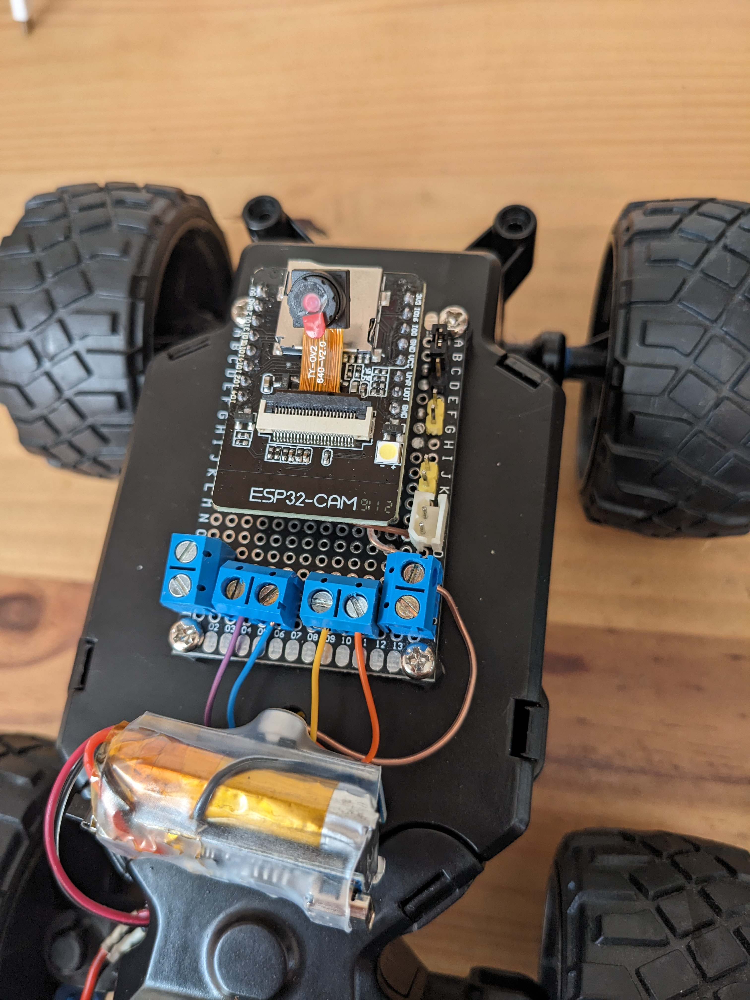
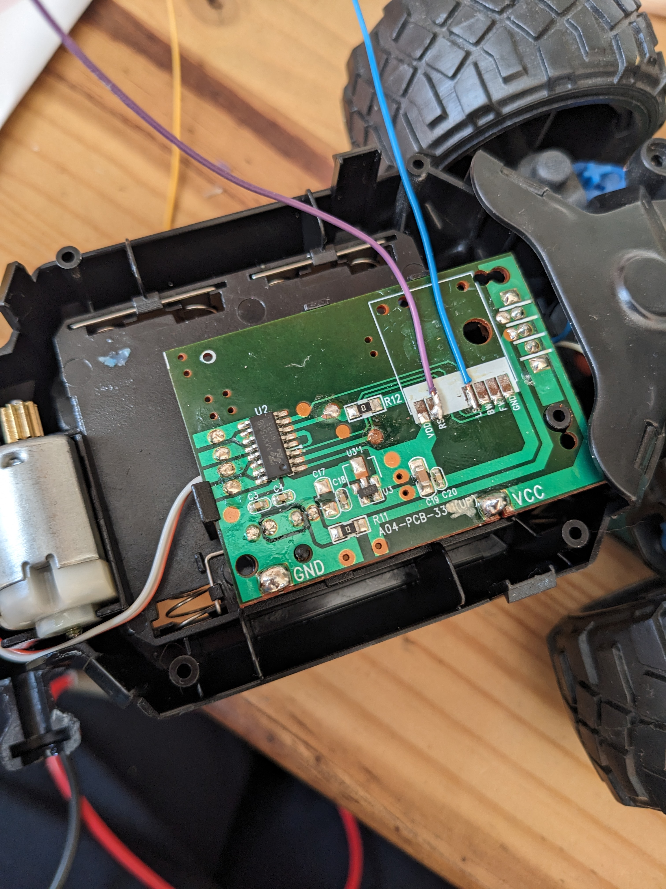

# rc_cars_esp32cam

## Description

This is a small project to repair a rc cars. Special thanks to following project & espressif api to make it possible easily:
* https://dronebotworkshop.com/ps3-esp32/
* https://community.element14.com/members-area/personalblogs/b/blog/posts/interfacing-ps3-with-esp32
* https://github.com/jvpernis/esp32-ps3
* https://docs.espressif.com/projects/esp-idf/en/v5.3.1/esp32/index.html

## How to

Update PS3 controller MAC
* `cd ./tools`
* `./sixaxispair_install.sh`
* `cd ./sixaxis-pair_rs/target/x86_64-unknown-linux-gnu/debug`
* `./sixaxis_rs` to get MAC
* `./sixaxis_rs <MAC>` to set MAC

Clone PS3 submodule
* `git submodule init` 
* `git submodule update` 
* `./component_patch.sh` 

Build & flash esp32
* Set ESP32 in programming mode (GPIO0 to GND)
* Plug in FDTI
* `cd tools`
* `./docker_build.sh`
* `./docker_run.sh`
* `idf.py build`
* `idf.py -p /dev/ttyUSB0 flash`
* Power off & put ESP32 in boot mode (GPIO0 open)

## Pictures

